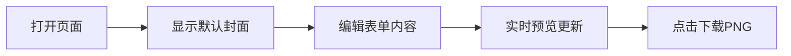

## 1. 产品概述

公众号封面图生成器是一个可视化工具，帮助内容创作者快速生成与参考图风格一致的公众号封面图片。用户可以通过表单编辑左侧文案、右侧卡片内容，实时预览并导出 2.35:1 比例的封面图。

## 2. 核心功能

### 2.1 功能模块
1. **封面预览区**: 按照 2.35:1 比例渲染封面图，左右分栏布局
2. **编辑面板**: 表单控制所有可替换的文本内容
3. **导出功能**: 将封面图导出为 PNG 图片

### 2.2 页面详情
| 页面名称 | 模块名称 | 功能描述 |
|---------|---------|---------|
| 首页 | 封面预览区 | 深色科技风背景，左侧标题区+右侧卡片区，实时渲染 |
| 首页 | 编辑面板 | 左侧表单：主标题、副标题、作者、日期等字段编辑 |
| 首页 | 导出按钮 | 一键下载封面图为 PNG |

## 3. 核心流程

用户打开页面 → 看到默认填充的封面预览 → 在左侧表单修改内容 → 封面实时更新 → 点击下载按钮保存 PNG

## 4. 用户界面设计

### 4.1 设计风格
- **主题**: 深色科技风，深蓝/黑色渐变背景，霓虹蓝紫色光效
- **配色**: 
  - 背景: 深蓝黑渐变 `#0a0e27` → `#000000`
  - 主标题: 白色 `#ffffff` + 渐变强调色 `#4facfe` → `#00f2fe`
  - 强调色: 蓝色 `#4facfe`, 紫色 `#a855f7`
  - 卡片背景: 半透明深色 `rgba(20, 30, 60, 0.8)` + 蓝色发光边框
- **字体**: 
  - 中文标题: 系统黑体 + 粗体
  - 英文: GitHub 风格无衬线字体
  - 使用 Google Fonts: `Noto Sans SC` 作为中文字体
- **布局**: 左右分栏，左侧编辑面板(约 40%)，右侧预览区(约 60%)
- **特效**: 背景光晕、卡片发光边框、渐变文字、底部波浪光效

### 4.2 封面图布局细节

**整体比例**: 2.35:1 (标准公众号封面比例)

**左侧区域 (约 45% 宽度)**:
- 大标题: "GitHub" (白色粗体) + "热榜" (渐变蓝青色)
- 副标题: "发现全球最火开源项目" (白色)
- 分隔线: 短横线装饰
- 四个特性标签: 实时热榜、精选项目、深度解读、每日更新 (带图标)
- 底部作者信息: "作者: 无乱码谈"

**右侧区域 (约 55% 宽度)**:
- 3D 倾斜卡片效果
- 卡片头部: GitHub Logo + "GitHub Trending" + 日期标签
- 排名 #1 项目卡片:
  - 排名数字 "1" (蓝色方块背景)
  - 项目名称 "decolua / 9router" (白色粗体)
  - 项目描述 (灰色)
  - 标签: AI, Poteway Gateway, LLM, API (蓝色边框胶囊)
  - 右侧星标图标 + "5.2k stars"
- 底部: "热度趋势: 持续上升" + 上升箭头
- 右下角: GitHub Octocat 图标装饰

**背景特效**:
- 深蓝黑色渐变背景
- 底部蓝色波浪光带
- 微妙的网格/点状纹理

### 4.3 响应式设计
- 桌面端: 左右分栏布局
- 移动端: 上下堆叠布局，编辑面板在上，预览在下

### 4.4 可编辑字段清单
| 字段 | 默认值 | 说明 |
|------|--------|------|
| 主标题前缀 | GitHub | 白色大字 |
| 主标题后缀 | 热榜 | 渐变强调色 |
| 副标题 | 发现全球最火开源项目 | |
| 特性1标题 | 实时热榜 | |
| 特性1描述 | 掌握最新趋势 | |
| 特性2标题 | 精选项目 | |
| 特性2描述 | 优质开源推荐 | |
| 特性3标题 | 深度解读 | |
| 特性3描述 | 技术价值分析 | |
| 特性4标题 | 每日更新 | |
| 特性4描述 | 不容错过的好项目 | |
| 作者名 | 无乱码谈 | |
| 日期 | 2026年5月10日 | |
| 排名 | 1 | |
| 项目名称 | decolua / 9router | |
| 项目描述 | AI routing gateway with fallback, auto retry, load balancing, and usage tracking. | |
| 标签1 | AI | |
| 标签2 | Poteway Gateway | |
| 标签3 | LLM | |
| 标签4 | API | |
| Stars数量 | 5.2k | |
| 热度趋势 | 持续上升 | |
