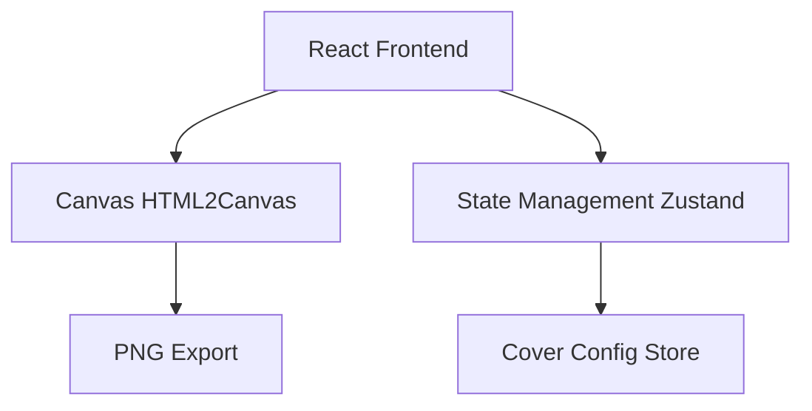

## 1. 架构设计



## 2. 技术描述

- **前端**: React@18 + TypeScript + Tailwind CSS + Vite
- **导出引擎**: html2canvas (将 DOM 渲染为 Canvas 后导出 PNG)
- **状态管理**: Zustand (管理封面所有可编辑字段)
- **图标**: Lucide React
- **字体**: Google Fonts - Noto Sans SC

## 3. 组件结构

| 组件 | 职责 |
|------|------|
| App | 主布局，左右分栏 |
| CoverPreview | 封面图渲染区域，包含所有视觉元素 |
| EditPanel | 左侧表单编辑面板 |
| CoverStore | Zustand store，管理所有可编辑状态 |

## 4. 数据模型

```typescript
interface CoverConfig {
  // 左侧区域
  mainTitlePrefix: string;
  mainTitleSuffix: string;
  subtitle: string;
  features: Array<{ icon: string; title: string; desc: string }>;
  author: string;
  
  // 右侧区域
  date: string;
  rank: number;
  projectName: string;
  projectDesc: string;
  tags: string[];
  stars: string;
  trendText: string;
}
```

## 5. 关键技术点

- 使用 CSS transform 实现右侧卡片的 3D 倾斜效果
- 使用 CSS gradient + text-fill-color 实现渐变文字
- 使用 box-shadow + border 实现卡片发光效果
- 使用 html2canvas 将封面 DOM 区域导出为 PNG
- 使用 CSS 变量管理主题色，便于统一调整
